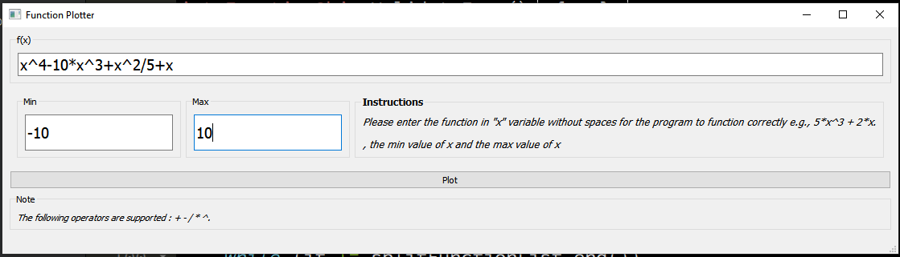
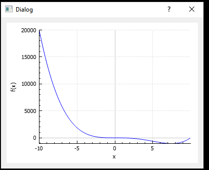

# Table of Contents

- [Table of Contents](#table-of-contents)
  - [**Description**](#description)
  - [**Overview of the application**](#overview-of-the-application)
  - [**Getting started**](#getting-started)
  - [**Tests**](#tests)
  - [**Project Structure**](#project-structure)
      - [**This structure has 4 main folders/directories :**](#this-structure-has-4-main-foldersdirectories-)

## **Description**
- This is Desktop Application with a simple UI to plot simple functions with support of these operators ``[ + - * / ^]``
Built with QT in C++.

 

## **Overview of the application**

 

## **Getting started**
- ### Demo application
 > Please download the compressed fille [Function Plotter.zip](Function%20Plotter.zip) and execute/run `Function Plotter.exe`
 

- ### Requirements and pre-requisites for development
>To effectively initialize this project, Developers needs to have [Qt 5.12](https://www.qt.io/offline-installers) with the suitable Mingw build kit on their machines and [Qt Creator](https://www.qt.io/offline-installers) to build the project.

 

- ### Start developing 
>To open the project in ``Qt Creator`` simply open the [task1.pro](task1.pro).

 

## **Tests**
- The tests are written using the [**Qt Test**](https://doc.qt.io/qt-5/qttest-index.html) to test helper function of the project. 

- The tests are run by using Qt Creator by opening the tst_className.pro from testing project in the [TestingHelperClasses](TestingHelperClasses/) folder.

- There are provided 26 tests provided in the [tst_funcobj.cpp](TestingHelperClasses/test_funcObj/tst_funcobj.cpp) to test 3 functions of [functionobj.cpp](HelperClasses/functionobj.cpp) :
  - `ValidateFunc()`
  - `splitWithDelimiter()`
  - `handlePower()`

  _Tests are still a working progress._

 

## **Project Structure**
      │   .gitignore
      │   README.md
      │   task1.pro
      │   task1.pro.user
      │
      ├───HelperClasses
      │       functionobj.cpp
      │       functionobj.h
      │       plot.cpp
      │       plot.h
      │       qcustomplot.cpp
      │       qcustomplot.h
      │
      ├───Main
      │       main.cpp
      │       mainwindow.cpp
      │       mainwindow.h
      │
      ├───TestingHelperClasses
      │   └───test_funcObj
      │           .gitignore
      │           test_funcObj.pro
      │           test_funcObj.pro.user
      │           tst_funcobj.cpp
      │
      └───ui
            mainwindow.ui
            plot.ui

 

#### **This structure has 4 main folders/directories :**
  

- [**HelperClasses**](HelperClasses/) which contains all custom made classes to help in the project 

  - The logic for the calculation of the inputted function is present in `FunctionObj` class in [functionobj.cpp](HelperClasses/functionobj.cpp) 

  - The logic for Plotting the graph is present in `Plot` class in [plot.cpp](HelperClasses/plot.cpp)

  - While `QCustomPlot` is a Qt C++ widget for plotting and data visualization in [qcustomplot.cpp](HelperClasses/qcustomplot.cpp) for more info on it please refer to their [site](https://www.qcustomplot.com/)

 

- [**Main**](Main/) which contains main classes of the program 
  - Main function in  [main.cpp](Main/main.cpp)
  - Main Window UI logic in [mainwindow.cpp](Main\mainwindow.cpp)

 

- [**UI**](UI/) which contains Qt Designer UI files of the project
  - The Main Window UI in [mainwindow.ui](UI/mainwindow.ui)
  - The Plot UI in [plot.ui](UI/plot.ui)
  > _all files in this folder can be edited as XML files but it is better to use `Qt creator` as it provides a what you see is what you get development experience_

